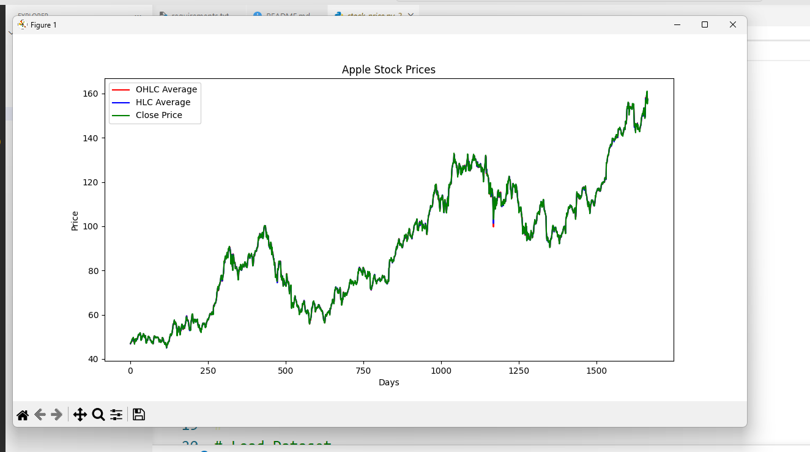
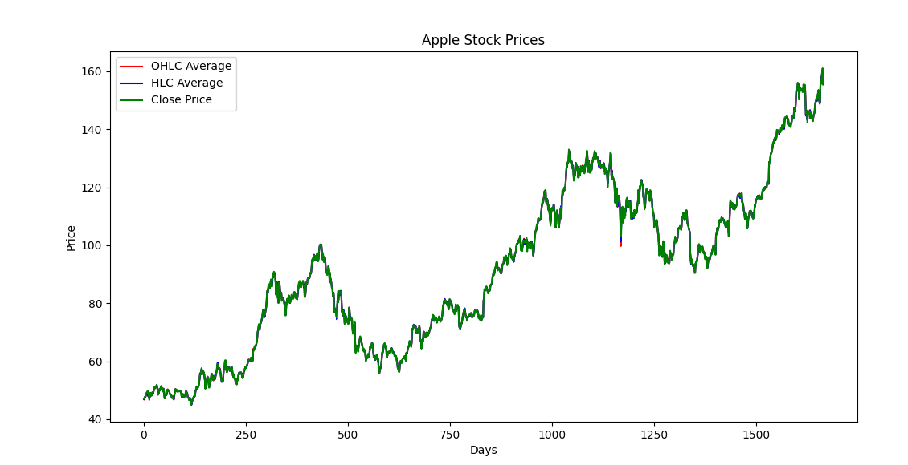

# 📈 Stock Price Prediction Using LSTM

## 📌 Description

This project predicts Apple stock prices using an LSTM (Long Short-Term Memory) neural network built with TensorFlow and Keras.

## 🚀 Features

- Data preprocessing
- Min-Max Scaling
- LSTM Deep Learning Model
- Stock Price Prediction
- RMSE Evaluation
- Prediction Visualization

## 🛠 Technologies Used

- Python
- TensorFlow
- Keras
- Pandas
- NumPy
- Matplotlib
- Scikit-Learn

## 📁 Project Structure

```
Stock-Price-Prediction-Using-LSTM
│── stock_price.py
│── preprocessing.py
│── apple_share_price.csv
│── requirements.txt
│── README.md
```

## ▶️ Installation

```bash
pip install -r requirements.txt
```
## ▶️ Run
```bash
python stock_price.py
```
## 📊 Output
The model predicts stock prices and visualizes:
- Original Prices
- Training Prediction
- Testing Prediction
## 📸 Project Output
<p align="center">
  
</p>
<p align="center">
  
</p>
## 👩‍💻 Author
Karnatakam Sakshi
